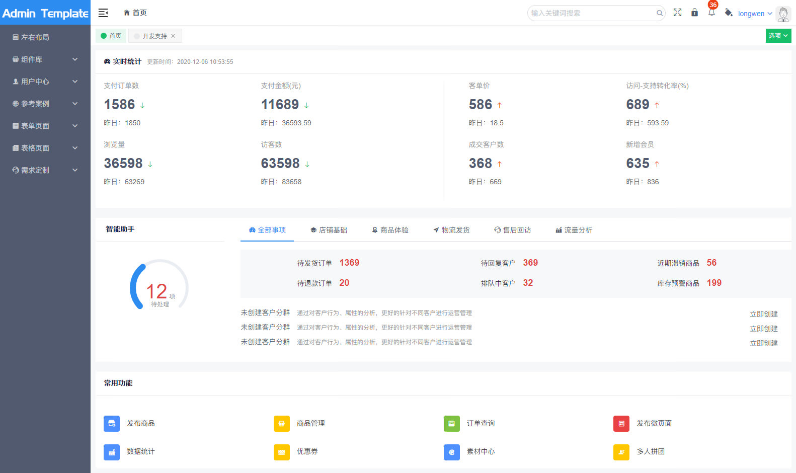
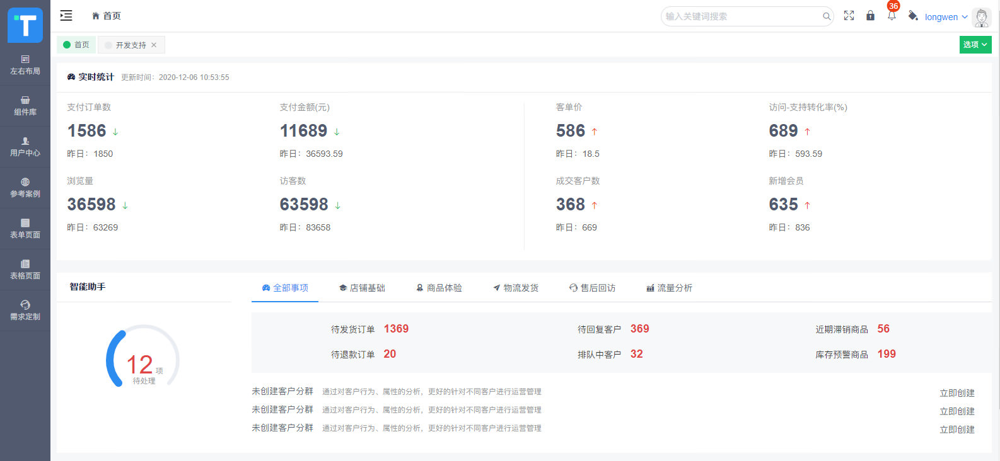

# vue-admin 中后台 UI框架
1. iview-admin-template
2. 脚手架 `vue-cli2.9` & `webpack3.6`
3. 基础工具链
	- vue 2.6+
	- vue-router 3.1+
	- vuex 3.1+
	- view-design 4.1+
	- echart 4.6+
	- axios 0.19
	- lodash

4. [vue-admin](https://github.com/lulongwen/iview-admin) 基于 [iview-amdin](https://github.com/iview/iview-admin) 开发

5. [联系卢珑文](https://lulongwen.com)


首页预览


菜单收起效果


login.vue 登录页


## 项目特性总结：

1. 精简字体图表
  - 默认图标 860个，只选择 ios全部图标，logo部分图标
  - 其他没有的用 svg 代替
    - https://ionicons.com/v4
    - https://github.com/ionic-team/ionicons/tree/4.x/src/svg
    - https://www.toicon.com/series/feather

2. SvgIcon 定制渲染图标
  - `<SvgIcon icon="outdent"/>`
  - 缺点：全部加载
  - https://blog.csdn.net/caseywei/article/details/89328551

3. gulp 重新编译 less 文件，趋于扁平化风格

4. Menu 菜单
  - 展开用的是 Menu组件
  - 收起隐藏 Menu组件，用的 Dropdown
  - 渲染的时候要判断菜单展开，还是隐藏，渲染不同的菜单

5. 封装组件库，面向数据编程，数据驱动响应页面
  1. Echarts
  2. Countup.js
  3. FormGroup.vue
  4. TableEdit.vue


## 启动项目

``` bash
git clone git@github.com:lulongwen/iview-admin.git

# 1 安装依赖 install dependencies
npm install

# 本地运行 serve with hot reload at localhost:8080
npm run dev

# 打包项目 build for production with minification
npm run build

# 打包分析 build for production and view the bundle analyzer report
npm run build --report

# run unit tests
npm run unit

# run e2e tests
npm run e2e

# run all tests
npm test
```

## 多环境配置
1. 本地环境 npm run dev
2. 线上环境 npm run build--prod
3. 测试环境 npm run build--test
4. 预发环境 npm run build--dev
  - https://www.cnblogs.com/1156063074hp/p/12028846.html
  - http://www.manongjc.com/detail/14-mnbotkyoymcxcnb.html

5. `cross-env` 环境变量管理


## vue-cli
1. [vue-cli 脚手架配置](http://vuejs-templates.github.io/webpack/)
2. [vue-loader 配置项](http://vuejs.github.io/vue-loader)
3. 新增 loader
  - `sass-resources-loader` 全局引入 scss变量


## mousewheel 事件
- FF使用DOMMouseScroll，其他浏览器都是用mousewheel
- https://developer.mozilla.org/zh-CN/docs/Web/API/Element/DOMMouseScroll_event
- https://developer.mozilla.org/zh-CN/docs/Web/Events/mousewheel
- https://blog.csdn.net/spy19881201/article/details/38704621


## Eslint 规范

1. `Parsing error: x-invalid-end-tag  vue/no-parsing-error`
  - https://github.com/iview/iview/issues/2828

```jsx
// .eslintrc.js 的 rules 加上
"vue/no-parsing-error": [2, { "x-invalid-end-tag": false }]

// vscode settings
"vetur.validation.template": false
```
